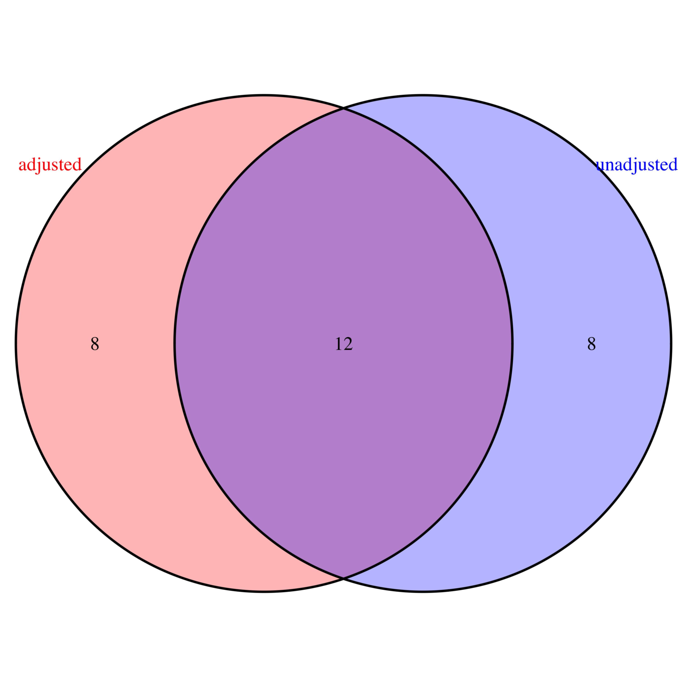

```{r,echo=FALSE}
knitr::opts_chunk$set(collapse = FALSE,comment = "#>",fig.pos='H')
```

</br>

# 1. Introduction

In alternative splicing analysis of RNA-seq data, one popular approach is to first identify gene features (e.g. exons or junctions) significantly associated with splicing using methods such as DEXSeq [@Anders2012] or JunctionSeq [@Hartley2016], and then perform pathway analysis based on the list of genes associated with the significant gene features. For results from the [DEXSeq](https://bioconductor.org/packages/release/bioc/html/DEXSeq.html) package, **gene features** represent non-overlapping exon counting bins (@Anders2012; Figure 1), while for results from the [JunctionSeq](https://bioconductor.org/packages/release/bioc/html/JunctionSeq.html) package, they represent non-overlapping exon *or* splicing-junction counting bins. 

Pathway analysis---without explicit adjustment---can be biased toward pathways that include genes with a large number of gene features; this is because these genes are more likely to be selected as "significant genes" in pathway analysis. This is a major challenge in RNA-seq data analysis, and this package offers a solution. The main features of the `PathwaySplice` package include: 

1. Visualize selection bias due to larger number of exons or junctions across different genes.
3. Formally test for bias using logistic regression.
4. Support gene sets based on Gene Ontology categories, user defined gene sets, or other broadly defined gene sets (e.g. MSigDB).
5. Identify specific genes that drive pathway significance.
6. Organize significant pathways within an enrichment map, where pathways with large numbers of overlapping genes are grouped together in a network presentation.

</br>

# 2. Package quick start guide 

After installing the `PathwaySplice` package, load the package namespace via:
```{r eval=TRUE, message=FALSE, warning=FALSE, results='hide'}
# source("https://bioconductor.org/biocLite.R")
# biocLite("PathwaySplice")
library(PathwaySplice)
```

Also, the development version can also be installed by
```{r eval = FALSE}
library(devtools)
install_github("SCCC-BBC/PathwaySplice", ref = "development")
```

The input file of the `PathwaySplice` functions are a vector of $p$-values associated with gene features and a mapping between gene features and genes. This information can be obtained from `DEXSeq` or `JunctionSeq` output files. As an example, `PathwaySplice` includes a gene-feature annotated dataset, based on an RNA-seq study of bone marrow CD34+ cells from eight myelodysplastic syndrome (MDS) patients with SF3B1 mutations and four patients without the mutation [@Dolatshad2015]. This dataset was downloaded from the GEO database with accession key [GSE63569](https://www.ncbi.nlm.nih.gov/geo/query/acc.cgi?acc=GSE63569).

First, we use the `JunctionSeq` package to perform differential exon usage analysis. For demonstration, we selected gene features mapped to a random subset of 5,000 genes. The example dataset can be loaded directly:
```{r eval=TRUE, warning=FALSE, message=FALSE, results='markup'}
data(featureBasedData)
head(featureBasedData)
```

Next, convert the example data to a gene-based table with the `makeGeneTable` function. The $p$-value method is the default.
```{r eval=TRUE, message=FALSE, warning=FALSE, results='markup'}
gene.based.table <- makeGeneTable(featureBasedData, stat = "pvalue")
head(gene.based.table)
```
Here, the `geneWisePvalue` column is simply the minimum feature-based $p$-value among gene features for gene ENSG00000000938, `numFeature` represents the number of gene features for that gene, `fdr` measures the false discovery rate (FDR) adjustment for the $p$-value given in the `genewisePvalue` column, and `sig.gene = 1` indicates that the gene is significant at the $\alpha = 0.05$ level.

To assess selection bias, i.e. whether genes with more features are more likely to be selected as significant, the `lrTestBias` function fits a logistic regression to test the association between `sig.gene` and `numFeature`.
```{r eval=TRUE, warning=FALSE, message=FALSE, results='markup'}
lrTestBias(gene.based.table, boxplot.width = 0.3)
```

Note that---typically---selection bias remains even when the `stat = "fdr"` option is used to select significant genes in `makeGeneTable` instead of `stat = "pvalue"` (the default option). This is becasue the FDR has a monotonic relationship with $p$-values. For example, in our `featureBasedData` example data set, when  selecting significant genes using the `"fdr"` option, substantial selection bias remains (as shown in the boxplot below). 
```{r eval=TRUE, message=FALSE, warning=FALSE, results='markup'}
gene.based.table.fdr <- makeGeneTable(featureBasedData, stat = "fdr")
lrTestBias(gene.based.table.fdr, boxplot.width = 0.3)
```

Further, notice that when we specified the `stats = "pvalue"` option, gene ENSG00000000938 was significant. However, after FDR adjustment, that is no longer the case. In light of this comparison, the output from the `makeGeneTable` function for the `"fdr"` or `"pvalue"` options will differ only in the `sig.gene` indicator column.
```{r}
head(gene.based.table.fdr)
```

To perform pathway analysis that adjusts for the number of gene features, we use the `runPathwaySplice` function, which implements the methodology described in @Young2010. The `runPathwaySplice` function returns a [`tibble`](https://cran.r-project.org/web/packages/tibble/vignettes/tibble.html) object. Tibbles are similar in structure to data frames but use a different `print` method: they show only the first few rows and as many columns that will fit on the screen. Therefore, your tibbles may print differently that what is shown here.

```{r eval=TRUE,warning=FALSE,message=FALSE,results='markup'}
result.adjusted <- runPathwaySplice(genewise.table = gene.based.table.fdr,
                                    genome = "hg19",
                                    id = "ensGene",
                                    test.cats = c("GO:BP"),
                                    go.size.limit = c(5, 30),
                                    method = "Wallenius",
                                    use.genes.without.cat = TRUE)

head(result.adjusted)
```

The returned `result.adjusted` tibble has the statistical significance of each pathway shown in the `over_represented_pvalue` column, significant genes which drive pathway significance are given in lists in the `SIGgene_ensembl` column (not shown), and the list of corresponding gene symbols is returned in the `SIGgene_symbol` column (also not shown). An additional bias plot is also generated; this visualizes the relationship between the proportion of significant genes and the mean number of gene features within gene bins. Note that the default option for `use.genes.without.cat` is `FALSE`, meaning that genes not mapped to any tested categories are ignored in the analysis. In order for all genes in `genewise.table` to be counted towards the total number of genes outside the category (i.e. genes in the background), we set this option to `TRUE`.  

To visualize pathway analysis results in a pathway enrichment network, we use the `enrichmentMap` function. The `pathway.res` input of this function is the output of `runPathwaySplice` shown above. The `n = 7` argument means that the produced figure will show the 7 most significant genes in an enrichment map. A file named `network.layout.for.cytoscape.gml` is generated in the `~/PathwaySplice_output` directory (a subdirectory of your working directory, but you have the ability to specify another output directory). This file can be used as an input file for Cytoscape software [@Shannon2003], which allows users to further manually adjust the appearance of the generated network.
```{r eval=TRUE, warning=FALSE,message=FALSE,results ='markup', fig.align='right', fig.height=10, fig.width=14}
enmap <- enrichmentMap(pathway.res = result.adjusted,
                       n = 7,
                       output.file.dir = file.path("~/PathwaySplice_output"),
                       similarity.threshold = 0.5, 
                       scaling.factor = 2)
```

In the enrichment map, the **node size** indicates the number of significant genes within the pathway. The **node hue** indicates pathway significance, where smaller $p$-values correspond to dark red color. Pathways with [Jaccard coefficient](https://en.wikipedia.org/wiki/Jaccard_index) greater than the value of `similarity.thereshold` will be connected on the network, indicating that these connected pathways are "inter-related" by a common set of genes. The **edge thickness** corresponds to Jaccard similarity coefficient between the two pathways, scaled by the value supplied to `scaling.factor`. Note that the `enrichmentMap` function supports both GO annotation as well as customized gene sets. 

</br>

# 3. Testing customized gene sets

### MSigDB hallmark pathways and Reactome pathways

To perform pathway analysis with other user-defined gene sets, one needs to specify the pathway database in [`.gmt` format](http://software.broadinstitute.org/cancer/software/gsea/wiki/index.php/Data_formats) first, then use the `gmtGene2Cat` function before passing this output as the value of the `gene2cat` argument of the `pathwaySplice` function. The MSigDB hallmark gene sets can be downloaded from [the Broad institute](http://software.broadinstitute.org/gsea/msigdb/collections.jsp). Similarly, Reactome pathways in `.gmt` format can be downloaded from [REACTOME](https://reactome.org/download-data): in the "Specialized data formats" page section click the "Reactome Pathways Gene Set" link to download the zipped file.

For demonstration, we have included a sample of hallmark gene sets in the package. The `gmtGene2Cat` function takes in a directory wherein a `.gmt` file is stored and imports that file for internal use. Analysis for hallmark gene sets can be accomplished using the following code:
```{r eval=FALSE, message = FALSE, warning=FALSE, fig.show='hide'}
dir.name <- system.file("extdata", package = "PathwaySplice")
hallmark.local.pathways <- file.path(dir.name, "h.all.v6.0.symbols.gmt.txt")
hlp <- gmtGene2Cat(hallmark.local.pathways, genomeID = "hg19")

result.hallmark <- runPathwaySplice(genewise.table = gene.based.table.fdr,
                                    genome = "hg19",
                                    id = "ensGene",
                                    gene2cat = hlp, 
                                    go.size.limit = c(5, 100), 
                                    method = "Wallenius", 
                                    binsize = 20,
                                    use.genes.without.cat = TRUE)
```                

### KEGG pathways

The KEGG pathways in `.gmt` format can be obtained by calling the `outKegg2gmt` function, which creates a `.gmt` file based on the organism specified. This is a wrapper for the `get.kegg.genesets` function from the [EnrichmentBrowser package](https://bioconductor.org/packages/release/bioc/html/EnrichmentBrowser.html) and modifies the output into a `.gmt` file [@Geistlinger2016]. This function takes in an organism id (`"hsa"` is for *homo sapiens* or `"mmu"` for *Mus musculus* (mouse)) and a file path where the `.gmt` file created by the `outKegg2Gmt` function should be stored. The following code can be used to perform pathway analysis on KEGG pathways. The first command (`outKegg2Gmt`) writes a `.gmt` file for homo sapiens in the directory specified; the second command reads this `.gmt` file, transforms these gene sets, and saves them as the `kegg.pathways` object; then the last command performs the pathway splice analysis.

```{r eval=FALSE, message=FALSE, warning=FALSE,results='markup',fig.show='hide'}

outKegg2Gmt("hsa", file.path(dir.name, "kegg.gmt.txt"))

kegg.pathways <- gmtGene2Cat(file.path(dir.name, "kegg.gmt.txt"),
                             genomeID = "hg19")

result.kegg <- runPathwaySplice(genewise.table = gene.based.table.fdr,
                                genome = "hg19",
                                id = "ensGene",
                                gene2cat = kegg.pathways, 
                                go.size.limit = c(5, 100), 
                                method = "Wallenius", 
                                use.genes.without.cat = TRUE)

```                 


</br>

# 4. Comparison of results before and after bias correction

To demonstrate the advantage of using the `PathwaySplice` package, we will illustrate pathway analysis using the entire 23,520 genes in the MDS dataset described in Section 2. Initial analysis was conducted using the `JunctionSeq` package to obtain $p$-values for differential exon usage. Because each gene may contain multiple exon counting bins or gene features [@Anders2012], the initial analysis can return multiple $p$-values associated with gene features belonging to that gene. We then used the `makeGeneTable` function to represent each gene by the minimum $p$-value among all gene features mapped to it. We saved this output in the `"AllGeneTable.rds"` file, which can be loaded using the following code.
````{r eval=FALSE}
dir <- system.file("extdata", package="PathwaySplice")
all.gene.table <- readRDS(file.path(dir, "AllGeneTable.rds"))
```
We next compared splicing pathway analysis results before and after adjusting for the number of exon counting bins associated with each gene. This can be accomplished using the `compareResults` function: 

```{r eval=FALSE, warning=FALSE, message=FALSE, results='markup', fig.show='hide'}
res.adj <- runPathwaySplice(genewise.table = all.gene.table,
                            genome = "hg19",
                            id = "ensGene",
                            test.cats = "GO:BP", 
                            go.size.limit = c(5, 30),
                            method = "Wallenius")
 
res.unadj <- runPathwaySplice(genewise.table = all.gene.table,
                              genome = "hg19",
                              id = "ensGene",
                              test.cats = "GO:BP",
                              go.size.limit = c(5, 30),
                              method = "Hypergeometric")
compareResults(n.go = 20,
               adjusted = res.adj,
               unadjusted = res.unadj,
               gene.based.table = all.gene.table,
               output.dir = "~/Test_Output_Directory/",
               type.boxplot = "Only3")
```

This function produces several files in the output directory specified by `output.dir`, including:  

* A Venn diagram that compares the overlap of the most significant `n.go` gene sets using adjusted and unadjusted analysis.
* A boxplot that compares the distribution of the numbers of
    * gene features belonging to all genes in the top `n.go` significant pathways identified by both adjusted and unadjusted analysis (`All`),
    * genes within the significant gene sets uniquely identified using adjusted analysis (`Adjusted`), and
    * genes within the significant gene sets uniquely identified using unadjusted analysis (`Unadjusted`).
* A `.csv` file with gene set names corresponding to different sections of the Venn diagram.

The Venn diagram below shows that among the top 20 most significant GO categories identified using adjusted and unadjusted analysis, there were 12 common GO categories.
<center>
{width=50%}
</center>

In the boxplot below, the `Unadjusted_20` boxplot shows the distribution of bias factors (i.e. numer of exon counting bins or gene features) for genes belonging to the 8 most significant GO categories identified only in unadjusted analysis (top row, corresponding to the blue color in the Venn diagram). The `Adjusted_20` boxplot shows the distribution of bias factors for genes belonging to the 8 most significant GO categories identified only in adjusted analysis (middle row, corresponding to the pink/orange color in the Venn diagram). The `All` boxplot shows distribution of bias factors for genes belonging to all 20 most significant GO categories. This plot shows that genes in GO categories which are unique to unadjusted analysis tend to have larger numbers of exon counting bins.
<center>

</center>

# 5. Comparison of results under different parameter settings

In the `runPathwaySplice` function, the choices for the `method` argument are:

* `"Hypergeometric"` -- do not adjust for bias.
* `"Wallenius"` -- adjust bias based on the  [Wallenius non-central hypergeometric distribution](https://en.wikipedia.org/wiki/Wallenius%27_noncentral_hypergeometric_distribution) [@Wallenius1963].
* `"Sampling"` -- use random sampling to approximate the true distribution.

The `"Sampling"` option takes `gene.based.table.fdr` as input to the `genewise.table` argument and then calculates weights for each gene using a spline regression model, which is the probability a gene being significant given the number of gene features (e.g. exons) associated with it. Next, random subsets of genes are sampled from the experiment. Each subset contains the same number of genes as the observed number of significant genes. For genes in each subset, the probability of selecting a gene is equal to the weights calculated above, and the number of genes belonging to a GO category is then calculated. Many random subsets of genes are generated to produce the null distribution necessary to estimate the $p$-value of a GO category (the number of random subsets is controlled by the `repcnt` argument to the `runPathwaySplice` function, and it defaults to 2000).

The figure below plots pathway analysis $p$-values for the MDS dataset obtained using the Hypergeometric test, Wallenius approximation, and `repcnt = 30000` random samples. These values are plotted against $p$-values obtained using `repcnt = 200000` random samples. This plot was constructed via the `compareResults2` function, which takes in output data frames from the `runPathwaySplice` function after providing different values to `methods`.
```{r eval=FALSE,warning=FALSE,message=FALSE,results='markup'}
compareResults2(result.hyper,
                result.Wall,
                result.Sampling,
                result.Sampling.200k)

```

In the figure above, each dot represents a GO category. The results show that GO category $p$-values for `repcnt = 30000` random samples and `repcnt = 200000` random samples are virtually indistinguishable (blue crosses and red triangles are almost exactly the same). Also, $p$-values based on the Wallenius approximation (green circles) are highly correlated with the results from the 200,000 random samples. On the other hand, unadjusted results using the Hypergeometric distribution (solid black dots) are markedly different from both random sampling and Wallenius $p$-values. In terms of computational cost, generating and analyzing 200,000 random samples took more than one hour, while $p$-values from the Wallenius approximation took less than one minute to compute. Therefore, we recommend using the Wallenius approximation (which we made the default for `runPathwaySplice` function), unless the number of gene sets tested is small---less than 100, for instance.


# 6. Conclusion

Performing pathway analysis without adjusting for the number of gene features can be biased toward pathways that include genes with a large number of gene features. Without adjustment, genes with more features are more likely to be selected as "significant genes" in pathway analysis. The `PathwaySplice` package is a potential solution to combat this major challenge in RNA-seq data analysis. To this end, this package assists end users in the following: perform pathway analysis while adjusting for the number features associated with each gene and allowing for a variety of potential types of gene sets; visualize and formally test for potential selection bias; identify specific genes which may drive pathway significance; and organize significant pathways within an enrichment map.

</br>

# References
<!-- Usage: rmarkdown::render("vignettes/tutorial.Rmd", output_format="all") -->
<!-- To build vignettes: devtools::install(build_vignettes = TRUE) -->
<!-- To have a look at vignettes: browseVignettes("PathwaySplice") or start R and open the vignette with vignette("tutorial", package="PathwaySplice") -->