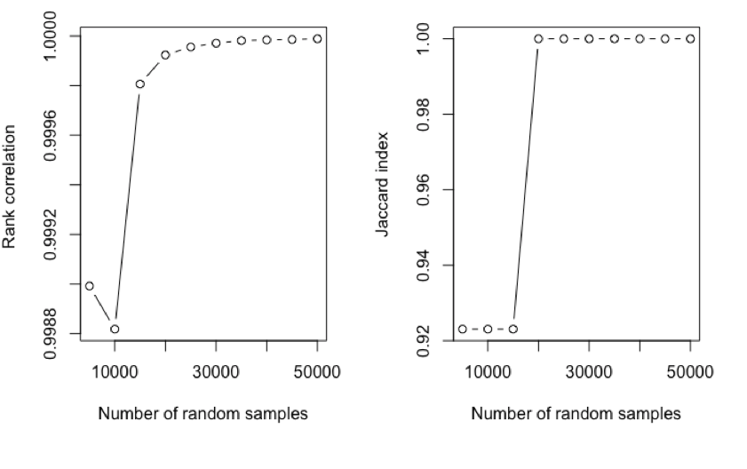

```{r,echo=FALSE}
knitr::opts_chunk$set(collapse = FALSE,comment = "#>",fig.pos='H')
```

# 1. Introduction

In alternative splicing ananlysis of RNASeq data, one popular approach is to first identify gene features (e.g. exons or junctions) significantly associated with splicing using methods such as DEXSeq [@Anders2012] or JunctionSeq [@Hartley2016], and then perform pathway analysis based on the list of genes associated with the significant gene features. 

For DEXSeq results, we use _gene features_ to refers to non-overlapping exon counting bins [@Anders2012, Figure 1], while for JunctionSeq results, _gene features_ refers to non-overlapping exon or splicing junction counting bins. 

A major challenge is that without explicit adjustment, pathways analysis would be biased toward pathways that include genes with a large number of gene features, because these genes are more likely to be selected as "significant genes" in pathway analysis.  

PathwaySplice is an R package that falicitate the folowing analysis: 

1. Performing pathway analysis that explicitly adjusts for the number of exons or junctions associated with each gene; 
2. Visualizing selection bias due to different number of exons or junctions for each gene and formally tests for presence of bias using logistic regression; 
3. Supporting gene sets based on the Gene Ontology categories, as well as more broadly defined gene sets (e.g. MSigDB) or user defined gene sets; 
4. Identifing the significant genes driving pathway significance and 
5. Organizing significant pathways with an enrichment map, where pathways with large number of overlapping genes are grouped together in a network graph.


# 2. Quick start on using PathwaySplice

After installation, the PathwaySplice package can be loaded into R using:
```{r eval=TRUE, message=FALSE, warning=FALSE, results='hide'}
library(PathwaySplice)
```

The latest version can also be installed by 
```{r eval=FALSE, message=FALSE, warning=FALSE, results='hide'}
library(devtools)

install_github("SCCC-BBC/PathwaySplice")
```

The input file of PathwaySplice are p-values for multiple gene features associated with each gene. This information can be obtained from DEXSeq [@Anders2012] or JunctionSeq [@Hartley2016] output files. As an example, PathwaySplice includes a feature based dataset within the package, based on a RNASeq study of bone marrow CD34+ cells from eight myelodysplastic syndrome (MDS) patients with SF3B1 mutations [@Dolatshad2015] and four patients without the mutation (Dolatshad, et al., 2015). This dataset was downloaded from GEO database (GSE63569). 

First, We used `JunctionSeq` R package to perform differential exon usage analysis. For demonstration, here we selected gene features mapped to a random subset of 5000 genes. 

The example dataset can be loaded directly:
```{r eval=TRUE, warning=FALSE, message=FALSE, results='markup'}
data(featureBasedData)

head (featureBasedData)
```

Next the **makeGeneTable** function can be used to convert it to a gene based table. 
```{r eval=TRUE, message=FALSE, warning=FALSE, results='markup'}
gene.based.table <- makeGeneTable(featureBasedData)

head(gene.based.table)
```
Here `geneWisePvalue` is simply the lowest feature based p-value for the gene, `numFeature` is number of features for the gene, `fdr` is false discovery rate for `genewisePvalue`, `sig.gene` indicates if a gene is significant.  

To assess selection bias, i.e. whether gene with more features are more likely to be selected as significant genes, **lrTestBias** function fits a logistic regression with `logit (sig.gene) ~ numFeature`

```{r eval=TRUE, warning=FALSE, message=FALSE, results='markup', fig.height=5, fig.width=5}
lrTestBias(gene.based.table,boxplot.width=0.3)
```

To perform pathway analysis that adjusts for the number of gene features, we use the **runPathwangSplice** function, which implements the methodology described in [@Young2010]. **runPathwangSplice** returns a   [tibble](https://cran.r-project.org/web/packages/tibble/vignettes/tibble.html) dataset  with statistical significance of the pathway (`over_represented_pvalue`), as well as the significant genes that drives pathway significance (`SIGgene_ensembl` and `SIGgene_symbol`). An additional bias plot that visualizes the relationship between the proportion of significant genes and the mean number of gene features within gene bins is also generated.

Note that the default option for `use.genes.without.cat` was set to `FALSE`, this means that genes not mapped to any tested categories are ignored in analysis. This would not be a problem when a large number of gene sets (such as GO:BP here) are tested. However, when testing a small number of gene sets, for example, limiting to a subset of GO:BP categories with certain size limits as we are doing here, users should set this option to `TRUE`, so that all genes in `genewise.table` are counted towards the  total  number  of  genes outside the category. 


```{r eval=TRUE,warning=FALSE,message=FALSE,results='markup'}
result.adjusted <- runPathwaySplice(gene.based.table,genome='hg19',
                        id='ensGene',
                        test.cats=c('GO:BP'),
                        go.size.limit=c(5,30),method='Wallenius', use.genes.without.cat = TRUE)

head(result.adjusted)
```

To visualize pathway analysis results in an enrichment network, we use the **enrichmentMap** function:

```{r eval=TRUE, warning=FALSE,message=FALSE,results ='markup', fig.align='right', fig.height=6, fig.width=10}
output.file.dir <- file.path("~/PathwaySplice_output")

enmap <- enrichmentMap(result.adjusted,n=7,
                       output.file.dir=output.file.dir,
                       similarity.threshold=0.5, 
                       scaling.factor = 2)
```

In the enrichment map, the `size of the nodes` indicates the number of significant genes within the pathway. The `color of the nodes` indicates pathway significance, where smaller p-values correspond to dark red color. Pathways with Jaccard coefficient > `similarity.thereshold` will be connected on the network. The `thickness of the edges` corresponds to Jaccard similarity coefficient between the two pathways, scaled by `scaling.factor`. A file named "network.layout.for.cytoscape.gml" is generated in the "~/PathwaySplice_output" directory. This file can be used as an input file for cytoscape software[@Shannon2003], which allows users to further maually adjust appearance of the generated network. 

# 3. Testing customized gene sets

### 3.1 MsigDB hallmark pathways and Reactome pathways

To performe pathway analysis for other user defined genesets, one needs to specify the pathway database in [.gmt format](http://software.broadinstitute.org/cancer/software/gsea/wiki/index.php/Data_formats) first and then use the `gmtGene2Cat` function before calling `pathwaySplice` function. 

The MsigDB hallmark gene sets can be downloaded from http://software.broadinstitute.org/gsea/msigdb/collections.jsp. Similarly, Reactome pathways in .gmt format can be downloaded from https://reactome.org/download-data under "Specialized data formats", click on "Reactome Pathways Gene Set". 

For demonstration, we have included a sample of hallmark genesets in the package. Analysis for hallmark genesets can be accomplished using the following code: 

```{r eval=FALSE, message = FALSE, warning=FALSE, fig.show='hide'}
dir.name <- system.file('extdata', package='PathwaySplice')

hallmark.local.pathways <- file.path(dir.name,'h.all.v6.0.symbols.gmt.txt')

hlp <- gmtGene2Cat(hallmark.local.pathways, genomeID='hg19')

result.hallmark <- runPathwaySplice(gene.based.table,genome='hg19',
                                    id='ensGene',
                                    gene2cat=hlp, 
                                    go.size.limit=c(5,100), 
                                    method='Wallenius', 
                                    binsize=20,
                                    use.genes.without.cat = TRUE)

head(result.hallmark [, c(1,2)])
```                

### 3.2 KEGG pathtways

The KEGG pathways in .gmt format can be obtained by calling the `outKegg2gmt` function, which calls the `get.kegg.genesets` function in EnrichmentBrowser R package and modifies the resulting output into a .gmt file. 

The following code can be used to perform pathway analysis for KEGG pathways: 

```{r eval=FALSE, message=FALSE, warning=FALSE,results='markup',fig.show='hide'}
data.dir <- system.file ("extdata", package = "PathwaySplice")

PathwaySplice::outKegg2Gmt("hsa",file.path(data.dir,"kegg.gmt.txt"))

kegg.pathways <- gmtGene2Cat(file.path(data.dir,"kegg.gmt.txt"), genomeID='hg19')

result.kegg <- runPathwaySplice(gene.based.table,
                                genome='hg19',
                                id='ensGene',
                                gene2cat=kegg.pathways, 
                                go.size.limit=c(5,100), 
                                method='Wallenius', 
                                use.genes.without.cat = TRUE)

head (result.kegg [, c(1,2,4,5)])

```                 


# 4. Comparison of results before and after bias correction

To demonstrate the advantage of PathwaySplice, we next illustrate pathway analysis using the entire 23520 genes in the MDS dataset described above under Section 2. Briefly, this public RNAseq dataset (GEO accession: GSE63569) was generated by (Dolatshad, et al., 2015) who studied transcriptomes of bone marrow CD34+ cells from myelodysplastic syndrome (MDS) patients with SF3B1 mutations vs. patients without the mutation. 

Initial analysis was conducted using `JunctionSeq` R package to obtain p-values for differential exon usage. Because a gene can have multiple exon counting bins [@Anders2012] associated with it, there can be multiple p-values for some of the genes. We then used `makeGeneTable` to represent each gene by the smallest p-value among all exon counting bins mapped to it. The resulting dataset for all 23520 genes can be loaded using the following code: 

````{r eval=FALSE}
dir <- system.file("extdata", package="PathwaySplice")

all.gene.table <- readRDS(file.path(dir, "AllGeneTable.rds"))
res.adj <- runPathwaySplice(all.gene.table,
                            genome='hg19',
                            id='ensGene',
                            test.cats = "GO:BP", 
                            go.size.limit = c(5, 200),
                            method='Wallenius')
 
res.unadj <- runPathwaySplice(all.gene.table,
                              genome='hg19',
                              id='ensGene',
                              test.cats = "GO:BP",
                              go.size.limit = c(5, 200),
                              method='Hypergeometric')
 
compareResults(20, res.adj, res.unadj, all.gene.table, type.boxplot='Only3', output.dir = "~/OutputTestPathwaySplice_all_gene_GO_BP/")

```

We next compared splicing pathway analysis results before and after adjusting for the number of exon counting bins associated with each gene. This can be accomplished using the `compareResults` function: 

```{r eval=FALSE, warning=FALSE, message=FALSE, results='markup', fig.show='hide'}

dir <- system.file("extdata", package="PathwaySplice")

res.adj <- runPathwaySplice(all.gene.table,
                            genome='hg19',
                            id='ensGene',
                            test.cats = "GO:BP",  
                            go.size.limit = c(5, 30),
                            method='Wallenius')

res.unadj <- runPathwaySplice(all.gene.table,
                              genome='hg19',
                              id='ensGene',
                              test.cats = "GO:BP",
                              go.size.limit = c(5, 30),
                              method='Hypergeometric')

compareResults (n.go = 20, 
                adjusted = res.adj,
                unadjusted = res.unadj,
                gene.based.table = all.gene.table,
                type.boxplot='Only3', 
                output.dir = "C:/TEMP")
```

The above code produces several files in the output directory specified by `output.dir`, including:  

* a venn diagram that compares the overlap of most significant `n.go` gene sets in adjusted and unadjusted analysis
* a boxplot that compares distributions of number of features within all genes in significant gene sets, with or without adjusting for bias factors
* a .csv file with gene set names belonging to different sections of the venn diagram 

The venn diagram below shows that among the top 20 most significant GO categories identified in adjusted and unadjusted analysis, there were 12 common GO categories. 


In the boxplot below, the first box shows distribution of bias factors (i.e. numer of exon counting bins) for genes belonging to the 8 most significant GO categories identified only in unadjusted analysis (blue color in the venn diagram). The second box shows distribution of bias factors (i.e. number of exon counting bins) for genes belonging to the 8 most significant GO categories identified only in adjusted analysis (pink color in the venn diagram). The third box shows distribution of bias factors (i.e. number of exon counting bins) for genes belonging to all 20 most significant GO categories. This plot shows that genes in GO categories that are unique to unadjusted analysis tend to have larger number of exon counting bins.


# 5. Comparison of results under different paramter settings
- compare Wall vs. sampling
- different sampling nubmers

We compared different analysis procedures of using Hypergeometric test, Wallenius approximation, 30k random sampling and 200k random sampling, we use the **compareResults2** function:
```{r eval=FALSE,warning=FALSE,message=FALSE,results='markup'}
PathwaySplice:::compareResults2(result.hyper,result.Wall,result.Sampling,result.Sampling.200k)

```

200k random sampling took more than 1 hours to get resutls for this test data set. 


In the above Figure, Wallenius approximation, 30k random sampling and 200k random sampling are 
labeled by green, blue and red color; and hypergeometric test are labeled by black color. it is obvious that
adjusting feature number bias has effects on results, and the results of 30k random sampling and 200k random sampling are close, which suggests that 30k random sampling can get accurate results in a reasonable computational time, and Wallenius approximation is a faster computational precedure to get adjusted results also.  


In **runPathwangSplice**, we use hypergeometric test to calcualte the unadjusted pathway enrichment p value, and use  either Wallenius approximation or sampling merthod to obtain the adjusted pathway enrichment p value. For sampling method, we supply a function **tuningRepcnt** to let use tune number of random samples to get the converged results. users can perform the tuning step as the following:   

```{r eval=FALSE, message=FALSE, warning=FALSE,results='hide',fig.show='hide'}
res.cor <- PathwaySplice:::tuningRepcnt(gene.based.table,n=25,repcnt.start = 1000,repcnt.end=50000)

```

User will get a figure to show how results are converged as number of random samples is increased:


The figure in left panel shows rank correlation on overrepresented p values of gene categories between two random samples, and the figure in right panel shows the similarity of top 25 gene categories 
measured Jaccard index between two random samples. The above figure shows using more than 30000 random samples
will get the converged results. Since sampling method is computationally intensive, so we also implementated a  Wallenius approximation method to make computation to be finished in a reasonable time.

```{r eval=FALSE,warning=FALSE,message=FALSE,results='markup'}
result.hyper <- runPathwaySplice(gene.based.table,genome='hg19',
                        id='ensGene',
                        test.cats=c('GO:BP'),
                        go.size.limit=c(5,30),method='Hypergeometric')

result.Wall <- runPathwaySplice(gene.based.table,genome='hg19',
                        id='ensGene',
                        test.cats=c('GO:BP'),
                        go.size.limit=c(5,30),method='Wallenius')

result.Sampling <- runPathwaySplice(gene.based.table,genome='hg19',
                        id='ensGene',
                        test.cats=c('GO:BP'),
                        go.size.limit=c(5,30),method='Sampling',repcnt = 30000)

result.Sampling <- runPathwaySplice(gene.based.table,genome='hg19',
                        id='ensGene',
                        test.cats=c('GO:BP'),
                        go.size.limit=c(5,30),method='Sampling',repcnt = 30000)

start_time <- Sys.time()
result.Sampling.200k <- runPathwaySplice(gene.based.table,genome='hg19',
                        id='ensGene',
                        test.cats=c('GO:BP'),
                        go.size.limit=c(5,30),method='Sampling',repcnt = 200000)
end_time <- Sys.time()

time.used <- end_time-start_time
> time.used
Time difference of 1.33757 hours
```


# Reference
<!-- Usage: rmarkdown::render("vignettes/tutorial.Rmd", output_format="all") -->
<!-- To build vignettes: devtools::install(build_vignettes = TRUE) -->
<!-- To have a look at vignettes: browseVignettes("PathwaySplice") or start R and open the vignette with vignette("tutorial", package="PathwaySplice") -->