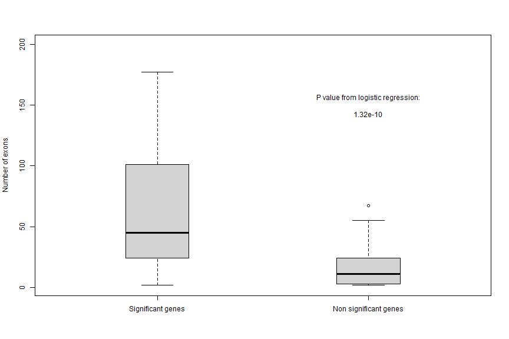
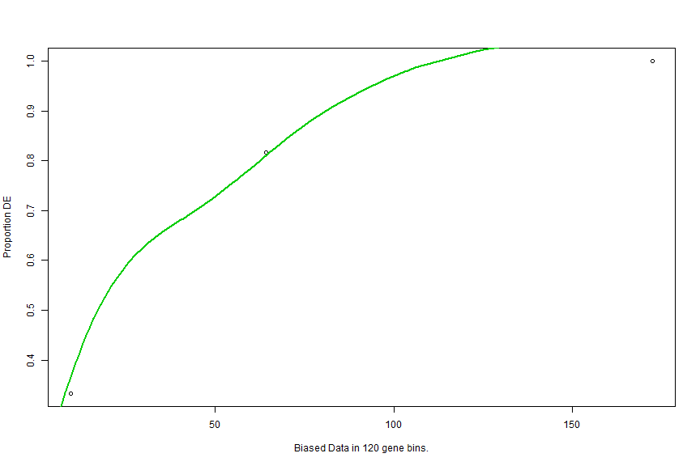
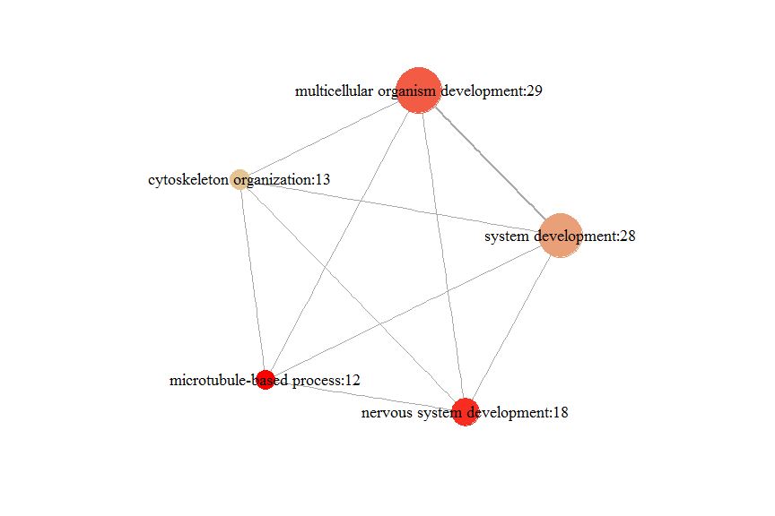

# Use PathwaySplice

+ Apply logistic regression model to identify bias factor

```r
library(PathwaySplice)
mds33 <- mds.11.sample[which(as.numeric(mds.11.sample$numExons)<=50),]
res <- lrtestbias(mds33, loc.x=2, loc.y=70,y_lim=80,boxplot_width=0.3) #loc.x and loc.y indicates location of p-value
```



+ Perform analysis using pathwaysplice

```r
# This function performes gene set analysis that adjusts for different number of gene subfeatures 
# (i.e. exons, spicing junctions, or gene length indicated by *adjust*) associated with each gene. 
# The significant genes are those with perGeneQvalue (from DEXSeq) < *threshold*. 
res <- runpathwaysplice(mds.11.sample,adjust='exon_SJ',sub_feature='E',
threshold=0.05,genomeID='hg19',geneID='ensGene',method='Wallenius')
```



+ Build up network based on the overlap between gene sets and visualize this network


```r
#GO
# SimilarityThreshold: Gene sets with Jaccard coefficient > similarity threshold are connected by a line,
# with thickness proportional to Jaccard coefficient    
enmap <- enrichmentmap(res,n=5,SimilarityThreshold=0)
```


